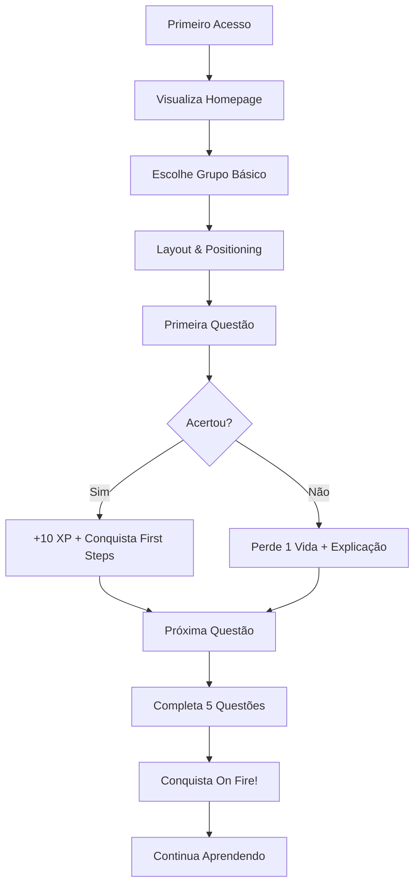
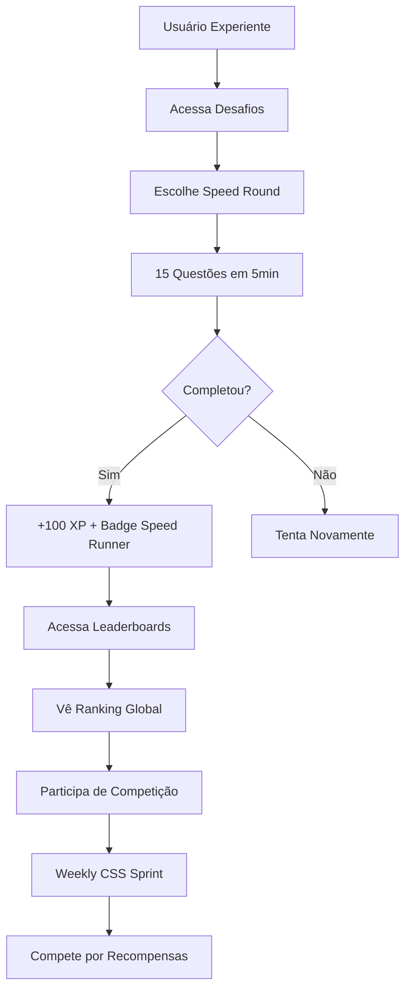
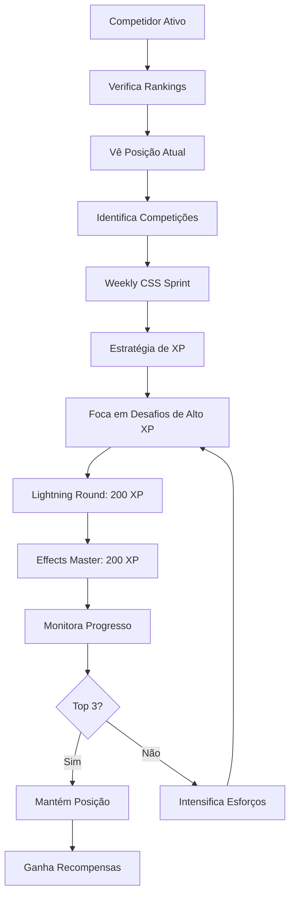
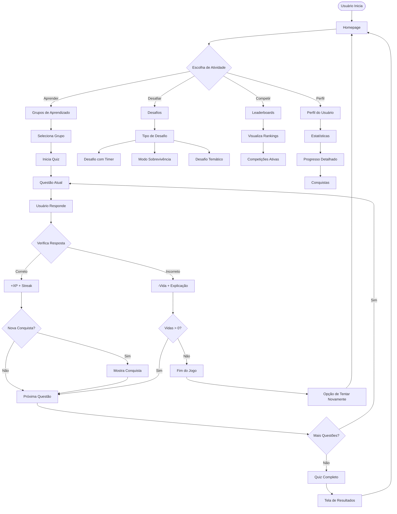
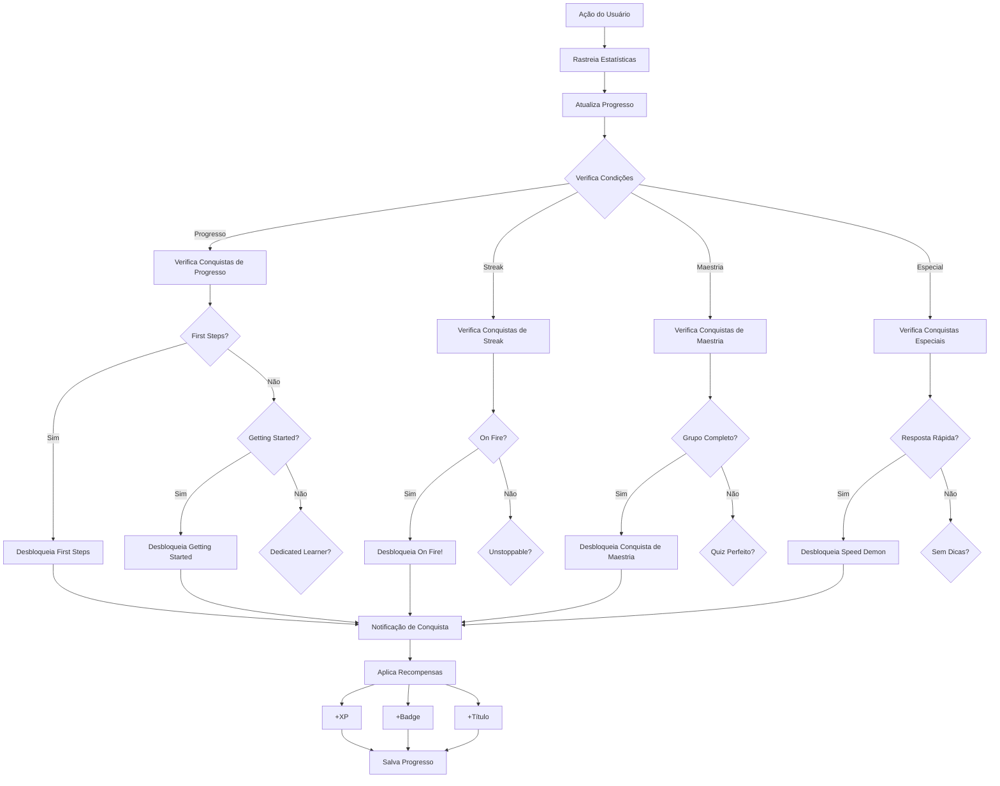
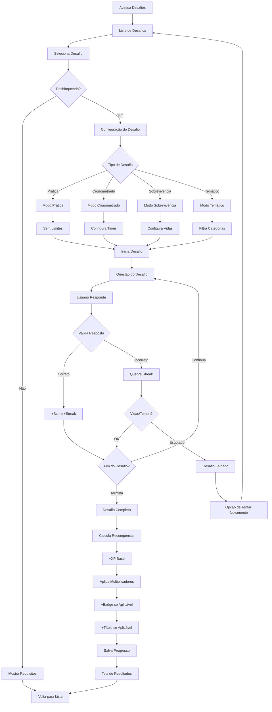
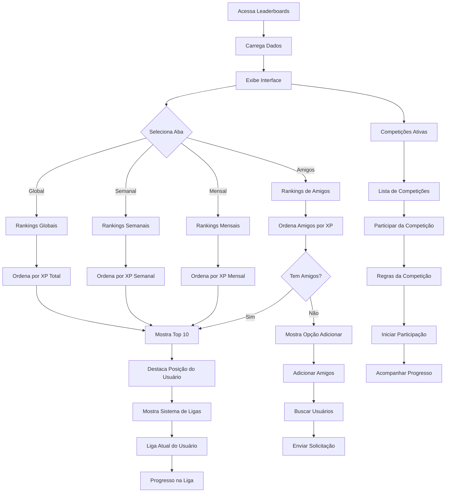
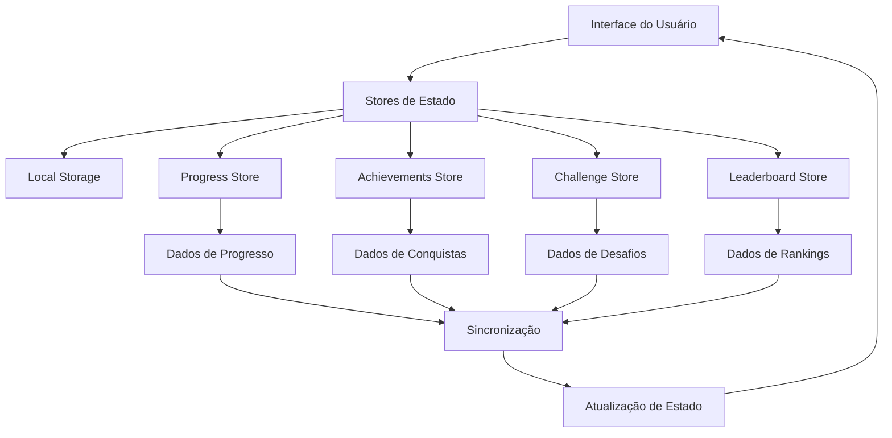

# 🚀 TailwindTrainer - Master TailwindCSS Interactively


## 🚀 **PROJECT STATUS - READY FOR DEPLOYMENT** ✅

**TailwindTrainer** é uma plataforma interativa e gamificada para aprender e dominar TailwindCSS através de quizzes, desafios e competições. Transforme seu aprendizado em uma jornada envolvente com sistema de progressão, conquistas e rankings globais!

### 🎯 **Latest Updates** (June 30, 2025)

-   ✅ **CI/CD Pipeline**: Complete GitHub Actions workflow implemented
-   ✅ **Quality Gates**: Automated testing, security, and deployment
-   ✅ **Code Coverage**: 80%+ coverage requirement with automated reporting
-   ✅ **Critical Bug Fixed**: Challenge input advancing automatically - RESOLVED
-   ✅ **Build Ready**: Production build tested and successful
-   ✅ **Deployment Ready**: Compatible with Vercel/Netlify
-   ✅ **Next.js 14**: Updated to latest stable version
-   ✅ **TypeScript Issues**: All compilation errors resolved
-   ⭐ **NEW: Question Management System**: Centralized JSON-based question database with real CSS validation

### 🔧 **Deployment & Development**

-   **CI/CD**: See [.github/workflows/README.md](./.github/workflows/README.md)
-   **Contributing**: See [CONTRIBUTING.md](./CONTRIBUTING.md)
-   **Vercel**: See [VERCEL_DEPLOY.md](./VERCEL_DEPLOY.md)
-   **General**: See [DEPLOY.md](./DEPLOY.md)
-   **Testing**: See [TESTING.md](./TESTING.md)

### 🧪 **Quality Assurance**

-   **Unit Tests**: 13 tests passing with 80%+ coverage
-   **E2E Tests**: 18+ scenarios covering all user journeys
-   **Automated QA**: ESLint, TypeScript, Security audit
-   **Performance**: Bundle size monitoring and optimization

---

## 📋 Índice

-   [🌟 Funcionalidades Principais](#-funcionalidades-principais)
-   [🎯 Jornadas do Usuário](#-jornadas-do-usuário)
-   [📊 Diagramas de Fluxo](#-diagramas-de-fluxo)
-   [🏗️ Arquitetura do Sistema](#️-arquitetura-do-sistema)
-   [🚀 Como Usar](#-como-usar)
-   [📱 Capturas de Tela](#-capturas-de-tela)
-   [🛠️ Tecnologias](#️-tecnologias)
-   [📈 Roadmap](#-roadmap)

---

## 🌟 Funcionalidades Principais

### 🎓 **Sistema de Aprendizado Progressivo**

#### **Grupos de Aprendizado Estruturados**

-   **Layout & Positioning** (15 lições)

    -   Flexbox, Grid, Positioning
    -   Dificuldade: Iniciante
    -   Desbloqueado por padrão

-   **Typography** (15 lições)

    -   Font sizes, weights, spacing
    -   Dificuldade: Iniciante
    -   Desbloqueado por padrão

-   **Colors & Backgrounds** (15 lições)

    -   Color system, gradients, opacity
    -   Dificuldade: Intermediário
    -   Desbloqueado por padrão

-   **Spacing & Sizing** (15 lições)

    -   Margins, padding, dimensions
    -   Dificuldade: Iniciante
    -   Desbloqueado por padrão

-   **Effects & Animations** (20 lições)

    -   Shadows, transforms, transitions
    -   Dificuldade: Avançado
    -   Requer conclusão dos grupos básicos

-   **Responsive Design** (12 lições)
    -   Breakpoints, responsive utilities
    -   Dificuldade: Avançado
    -   Requer conclusão dos grupos básicos

#### **Sistema de Progressão Inteligente**

```
Desbloqueio Sequencial:
├── Grupos Básicos (sempre disponíveis)
│   ├── Layout & Positioning
│   ├── Typography
│   ├── Colors & Backgrounds
│   └── Spacing & Sizing
└── Grupos Avançados (requer conclusão dos básicos)
    ├── Effects & Animations
    └── Responsive Design
```

### 🏆 **Sistema de Conquistas e Gamificação**

#### **Categorias de Conquistas**

**📈 Progresso**

-   👶 **First Steps**: Complete sua primeira questão (10 XP)
-   🚀 **Getting Started**: Complete 10 questões (25 XP)
-   📚 **Dedicated Learner**: Complete 50 questões (100 XP + Título)
-   🎓 **CSS Master**: Complete 200 questões (500 XP + Título)

**🔥 Sequências (Streaks)**

-   🔥 **On Fire!**: Acerte 5 questões seguidas (50 XP)
-   ⚡ **Unstoppable**: Acerte 10 questões seguidas (150 XP + Título)
-   🌟 **Legendary Streak**: Acerte 25 questões seguidas (1000 XP + Título)

**💯 Maestria**

-   💯 **Perfectionist**: Complete um quiz com 100% de acerto (100 XP)
-   📐 **Layout Master**: Complete o grupo Layout & Positioning (200 XP + Título)
-   ✍️ **Typography Expert**: Complete o grupo Typography (200 XP + Título)
-   🎨 **Color Wizard**: Complete o grupo Colors & Backgrounds (200 XP + Título)
-   📏 **Spacing Guru**: Complete o grupo Spacing & Sizing (200 XP + Título)
-   ✨ **Effects Master**: Complete o grupo Effects & Animations (300 XP + Título)
-   📱 **Responsive Ninja**: Complete o grupo Responsive Design (300 XP + Título)
-   👑 **Tailwind Grandmaster**: Complete todos os grupos (1500 XP + Título)

**⭐ Especiais**

-   💨 **Speed Demon**: Responda uma questão em menos de 5 segundos (150 XP + Título)
-   🧠 **No Hints Needed**: Complete 20 questões sem usar dicas (300 XP + Título)
-   🔄 **Review Champion**: Complete 5 sessões de revisão (200 XP + Título)
-   📅 **Consistent Learner**: Estude por 7 dias consecutivos (400 XP + Título)

### 🎯 **Sistema de Desafios e Modos Especiais**

#### **Tipos de Desafios**

**🎯 Prática**

-   **Free Practice**: Pratique no seu ritmo

    -   Dicas e preview habilitados
    -   Sem limite de tempo
    -   5 XP por questão

-   **Quick Practice**: 10 questões aleatórias
    -   Sessão rápida de prática
    -   Dicas e preview habilitados
    -   25 XP total

**⏱️ Cronometrados**

-   **Speed Round**: 15 questões em 5 minutos

    -   Sem dicas ou preview
    -   100 XP + Badge "Speed Runner"
    -   Dificuldade: Médio

-   **Lightning Round**: 20 questões em 3 minutos
    -   Sem dicas ou preview
    -   200 XP + Badge "Lightning Fast"
    -   Requer grupos Layout e Typography
    -   Dificuldade: Difícil

**💀 Sobrevivência**

-   **Survival Mode**: Máximo de questões com 3 vidas

    -   Dicas habilitadas
    -   150 XP + Badge "Survivor"
    -   Dificuldade: Médio

-   **Hardcore Survival**: Sobrevivência sem ajudas
    -   Sem dicas ou preview
    -   300 XP + Badge "Hardcore Survivor"
    -   Requer completar Survival Mode
    -   Dificuldade: Difícil

**🎨 Temáticos**

-   **Layout Master Challenge**: Foco em flexbox e grid

    -   20 questões de Layout, Flexbox, Grid, Positioning
    -   120 XP + Badge "Layout Specialist"

-   **Color Wizard Challenge**: Maestria em cores

    -   15 questões de cores, gradientes, opacidade
    -   100 XP + Badge "Color Expert"

-   **Effects Master Challenge**: Efeitos avançados

    -   25 questões de shadows, transforms, transitions, filters
    -   Sem dicas, preview habilitado
    -   200 XP + Badge "Effects Wizard"
    -   Requer grupo Effects completo

-   **Responsive Ninja Challenge**: Design responsivo
    -   20 questões de display, grid, flexbox, typography, width
    -   Sem dicas ou preview
    -   250 XP + Badge "Responsive Master"
    -   Requer grupo Responsive completo

### 🏅 **Sistema de Leaderboards e Competição Social**

#### **Rankings Globais**

-   **Global**: Classificação por XP total
-   **Semanal**: Competição semanal por XP
-   **Mensal**: Competição mensal por XP
-   **Amigos**: Compare-se com seus amigos

#### **Sistema de Ligas**

```
🥉 Bronze League: 0 - 1,999 XP
🥈 Silver League: 2,000 - 4,999 XP
🥇 Gold League: 5,000 - 9,999 XP
💎 Platinum League: 10,000 - 14,999 XP
💠 Diamond League: 15,000+ XP
```

#### **Competições Ativas**

-   **Weekly CSS Sprint**: Competição semanal de XP

    -   Recompensas: 500 XP (1º), 300 XP (2º), 200 XP (3º)
    -   Badge "Weekly Champion" para o vencedor
    -   Título "Sprint Master" para o 1º lugar

-   **Flexbox Masters Tournament**: Torneio temático especial
    -   Foco em questões de Flexbox
    -   Recompensas: 1000 XP (1º), 600 XP (2º), 400 XP (3º)
    -   Badge "Flexbox Champion" para o vencedor
    -   Título "Flexbox Grandmaster" para o 1º lugar

### 👤 **Sistema de Perfil Completo**

#### **Estatísticas Detalhadas**

-   **Performance**: Precisão, tempo médio, melhor tempo
-   **Progresso**: Atividade semanal, progresso por categoria
-   **Conquistas**: Todas as conquistas desbloqueadas
-   **Histórico**: Sessões de estudo, streaks, revisões

#### **Perfil Social**

-   **Sistema de Amigos**: Adicionar/remover amigos
-   **Comparação**: Rankings entre amigos
-   **Compartilhamento**: Compartilhar conquistas
-   **Exportação**: Baixar dados de progresso

---

## 🎯 Jornadas do Usuário

### 🌱 **Jornada do Iniciante**



**Marcos da Jornada:**

1. **Primeiro Acesso** (0 min)

    - Visualiza homepage com grupos disponíveis
    - Vê sistema de progressão e conquistas

2. **Primeiras Questões** (5-10 min)

    - Escolhe grupo Layout & Positioning
    - Aprende mecânicas básicas (dicas, preview)
    - Ganha primeira conquista "First Steps"

3. **Primeira Sessão** (15-30 min)

    - Completa 5-10 questões
    - Experimenta sistema de dicas
    - Ganha conquista "On Fire!" (5 acertos seguidos)

4. **Primeira Semana** (7 dias)
    - Completa grupo Layout & Positioning
    - Ganha conquista "Layout Master"
    - Desbloqueia grupos avançados

### 🚀 **Jornada do Usuário Avançado**



**Marcos da Jornada:**

1. **Exploração de Desafios** (Semana 2-3)

    - Experimenta modos cronometrados
    - Testa limites com Survival Mode
    - Ganha badges especializados

2. **Competição Social** (Semana 3-4)

    - Acessa leaderboards
    - Adiciona amigos
    - Participa de competições semanais

3. **Maestria** (Mês 2-3)
    - Completa todos os grupos
    - Ganha título "Tailwind Grandmaster"
    - Atinge Diamond League

### 🏆 **Jornada do Competidor**



**Estratégias de Competição:**

1. **Maximização de XP**

    - Foca em desafios de alto valor (200+ XP)
    - Completa grupos para conquistas de maestria
    - Mantém streaks longos

2. **Timing Estratégico**

    - Monitora competições ativas
    - Planeja sessões intensivas
    - Aproveita multiplicadores de XP

3. **Progressão de Liga**
    - Bronze → Silver: 2,000 XP
    - Silver → Gold: 5,000 XP
    - Gold → Platinum: 10,000 XP
    - Platinum → Diamond: 15,000 XP

---

## 📊 Diagramas de Fluxo

### 🎮 **Fluxo de Gameplay Principal**



### 🏆 **Sistema de Conquistas**



### 🎯 **Fluxo de Desafios**



### 🏅 **Sistema de Leaderboards**



---

## 🏗️ Arquitetura do Sistema

### 📁 **Estrutura de Arquivos**

```
tailwind-trainer/
├── app/                          # Next.js App Router
│   ├── page.tsx                  # Homepage principal
│   ├── layout.tsx                # Layout global
│   ├── globals.css               # Estilos globais
│   ├── learn/                    # Sistema de aprendizado
│   │   └── [groupId]/
│   │       ├── page.tsx          # Página do grupo
│   │       ├── quiz-client.tsx   # Cliente do quiz
│   │       └── layout.tsx        # Layout do quiz
│   ├── challenges/               # Sistema de desafios
│   │   ├── page.tsx              # Lista de desafios
│   │   └── [challengeId]/
│   │       ├── page.tsx          # Página do desafio
│   │       ├── challenge-client.tsx # Cliente do desafio
│   │       └── layout.tsx        # Layout do desafio
│   ├── leaderboard/              # Sistema de rankings
│   │   └── page.tsx              # Página de leaderboards
│   └── profile/                  # Perfil do usuário
│       └── page.tsx              # Página de perfil
├── lib/                          # Lógica de negócio
│   ├── progressStore.ts          # Gerenciamento de progresso
│   ├── achievementsStore.ts      # Sistema de conquistas
│   ├── challengeStore.ts         # Gerenciamento de desafios
│   ├── leaderboardStore.ts       # Sistema de leaderboards
│   ├── questionManager.ts        # Motor de questões (novo sistema)
│   └── utils.ts                  # Utilitários
├── components/                   # Componentes reutilizáveis
│   └── ui/                       # Componentes de UI
│       ├── achievement-notification.tsx
│       ├── achievements-modal.tsx
│       ├── button.tsx
│       ├── card.tsx
│       ├── progress.tsx
│       ├── badge.tsx
│       ├── tabs.tsx
│       └── ...                   # Outros componentes shadcn/ui
└── README.md                     # Documentação
```

### 🔄 **Fluxo de Dados**



### 🗃️ **Estrutura de Dados**

#### **Progress Store**

```typescript
interface UserProgress {
    completedLessons: Record<string, number>;
    totalXP: number;
    streak: number;
    lastStudyDate: string;
    groupProgress: Record<string, GroupProgress>;
    dailyGoals: DailyGoals;
}

interface GroupProgress {
    progress: number; // 0-100%
    completedLessons: number;
    totalLessons: number;
}
```

#### **Achievements Store**

```typescript
interface Achievement {
    id: string;
    name: string;
    description: string;
    icon: string;
    category: "progress" | "streak" | "mastery" | "special";
    rarity: "common" | "rare" | "epic" | "legendary";
    condition: (progress: any, stats: any) => boolean;
    reward: { xp: number; title?: string };
}

interface UserStats {
    totalQuestions: number;
    correctAnswers: number;
    perfectQuizzes: number;
    maxStreak: number;
    groupsCompleted: string[];
    hintsUsed: number;
    reviewSessionsCompleted: number;
}
```

#### **Challenge Store**

```typescript
interface Challenge {
    id: string;
    name: string;
    type: "timed" | "survival" | "themed" | "practice";
    difficulty: "easy" | "medium" | "hard";
    config: ChallengeConfig;
    rewards: ChallengeRewards;
    requirements?: ChallengeRequirements;
}

interface ChallengeConfig {
    timeLimit?: number; // segundos
    lives?: number;
    questionCount?: number;
    categories?: string[];
    allowHints?: boolean;
    allowPreview?: boolean;
}
```

#### **Leaderboard Store**

```typescript
interface LeaderboardEntry {
    id: string;
    username: string;
    totalXP: number;
    level: number;
    streak: number;
    league: "Bronze" | "Silver" | "Gold" | "Platinum" | "Diamond";
    weeklyXP: number;
    monthlyXP: number;
    achievements: string[];
}

interface Competition {
    id: string;
    name: string;
    type: "weekly" | "monthly" | "special";
    startDate: string;
    endDate: string;
    participants: LeaderboardEntry[];
    rewards: CompetitionRewards;
}
```

---

## 🚀 Como Usar

### 🎯 **Para Iniciantes**

1. **Primeiro Acesso**

    ```
    1. Acesse a homepage
    2. Veja os grupos disponíveis
    3. Comece com "Layout & Positioning"
    4. Complete sua primeira questão
    5. Ganhe sua primeira conquista!
    ```

2. **Primeiros Passos**

    ```
    1. Use o sistema de dicas (💡)
    2. Ative o preview visual (👁️)
    3. Leia as explicações após cada resposta
    4. Mantenha um streak de acertos
    5. Complete o primeiro grupo
    ```

3. **Progressão**
    ```
    1. Complete grupos básicos (Layout, Typography, Colors, Spacing)
    2. Desbloqueie grupos avançados (Effects, Responsive)
    3. Experimente desafios de prática
    4. Ganhe conquistas de maestria
    5. Suba de liga no sistema de rankings
    ```

### 🏆 **Para Usuários Avançados**

1. **Desafios Cronometrados**

    ```
    1. Acesse a seção "Challenges"
    2. Tente o "Speed Round" (15 questões em 5min)
    3. Progrida para "Lightning Round" (20 questões em 3min)
    4. Ganhe badges especializados
    5. Melhore seus recordes pessoais
    ```

2. **Modo Sobrevivência**

    ```
    1. Comece com "Survival Mode" (3 vidas)
    2. Use dicas estrategicamente
    3. Progrida para "Hardcore Survival" (sem ajudas)
    4. Maximize sua pontuação
    5. Ganhe títulos exclusivos
    ```

3. **Competições Sociais**
    ```
    1. Acesse "Leaderboards"
    2. Veja sua posição nos rankings
    3. Participe de competições ativas
    4. Adicione amigos para competir
    5. Suba de liga (Bronze → Diamond)
    ```

### 🎮 **Estratégias de Maximização de XP**

#### **Alto Valor de XP**

```
🎯 Desafios Temáticos: 100-250 XP
⚡ Desafios Cronometrados: 100-200 XP
💀 Modo Sobrevivência: 150-300 XP
🏆 Conquistas de Maestria: 200-1500 XP
🔥 Streaks Longos: Multiplicador de XP
```

#### **Progressão Eficiente**

```
1. Foque em completar grupos (conquistas de maestria)
2. Mantenha streaks longos (multiplicadores)
3. Participe de competições semanais
4. Complete desafios de alto valor
5. Use modo de revisão para melhorar precisão
```

---

## 📱 Capturas de Tela

### 🏠 **Homepage**

-   Dashboard principal com progresso geral
-   Cards de grupos de aprendizado
-   Estatísticas rápidas (XP, streak, rank)
-   Acesso rápido a desafios e leaderboards

### 🎓 **Sistema de Aprendizado**

-   Interface de quiz interativa
-   Sistema de dicas contextuais
-   Preview visual das propriedades CSS
-   Explicações detalhadas após cada resposta
-   Progresso em tempo real

### 🏆 **Conquistas**

-   Modal de conquistas com categorias
-   Notificações animadas de novas conquistas
-   Sistema de raridade (comum → lendário)
-   Títulos desbloqueáveis

### 🎯 **Desafios**

-   Grid de desafios com diferentes tipos
-   Indicadores de dificuldade e recompensas
-   Sistema de desbloqueio progressivo
-   Timers e contadores de vida em tempo real

### 📊 **Leaderboards**

-   Rankings com abas (Global, Semanal, Mensal, Amigos)
-   Sistema visual de ligas
-   Competições ativas com contadores
-   Perfis de usuários com estatísticas

### 👤 **Perfil do Usuário**

-   Estatísticas detalhadas de performance
-   Gráficos de atividade semanal
-   Progresso por categoria
-   Histórico de conquistas

---

## 🛠️ Tecnologias

### **Frontend**

-   **Next.js 13+** - Framework React com App Router
-   **TypeScript** - Tipagem estática
-   **Tailwind CSS** - Framework de CSS utilitário
-   **shadcn/ui** - Componentes de UI modernos
-   **Lucide React** - Ícones SVG

### **Estado e Persistência**

-   **Local Storage** - Persistência de dados local
-   **Singleton Pattern** - Gerenciamento de estado global
-   **React Hooks** - Estado de componentes

### **Funcionalidades**

-   **Sistema de Gamificação** - XP, conquistas, rankings
-   **Algoritmos de Progressão** - Desbloqueio inteligente
-   **Sistema de Competições** - Rankings e torneios
-   **Analytics de Aprendizado** - Métricas de performance

### **Design e UX**

-   **Design System** - Componentes consistentes
-   **Responsive Design** - Adaptável a todos os dispositivos
-   **Micro-interações** - Animações e transições
-   **Acessibilidade** - WCAG 2.1 compliance

---

## 📈 Roadmap

### 🎯 **Versão Atual (v1.0)**

-   ✅ Sistema de aprendizado progressivo
-   ✅ Conquistas e gamificação
-   ✅ Desafios e modos especiais
-   ✅ Leaderboards e competições
-   ✅ Perfil de usuário completo

### 🚀 **Próximas Funcionalidades (v1.1)**

-   🔄 **Sistema de Revisão Inteligente**

    -   Algoritmo de repetição espaçada
    -   Revisão automática de questões erradas
    -   Recomendações personalizadas

-   👥 **Funcionalidades Sociais Avançadas**

    -   Sistema de amigos completo
    -   Grupos de estudo
    -   Compartilhamento de progresso

-   📊 **Analytics Avançados**
    -   Relatórios detalhados de performance
    -   Identificação de pontos fracos
    -   Sugestões de melhoria

### 🌟 **Funcionalidades Futuras (v2.0)**

-   🎨 **Editor de Questões**

    -   Criação de questões pela comunidade
    -   Sistema de moderação
    -   Questões contribuídas por usuários

-   🏫 **Modo Classroom**

    -   Funcionalidades para educadores
    -   Turmas e assignments
    -   Relatórios de progresso de alunos

-   🌐 **Multiplayer em Tempo Real**

    -   Duelos 1v1
    -   Torneios em tempo real
    -   Salas de competição

-   🤖 **IA e Personalização**
    -   Recomendações baseadas em IA
    -   Dificuldade adaptativa
    -   Caminhos de aprendizado personalizados

---

## 🎉 Conclusão

O **TailwindTrainer** representa uma abordagem inovadora para o aprendizado de TailwindCSS, combinando educação efetiva com elementos de gamificação envolventes. Com seu sistema progressivo, conquistas motivacionais e competições sociais, a plataforma transforma o aprendizado de CSS em uma jornada divertida e recompensadora.

### 🌟 **Principais Diferenciais**

-   **Gamificação Completa**: XP, conquistas, rankings e competições
-   **Progressão Inteligente**: Desbloqueio baseado em competência
-   **Variedade de Modos**: Prática, cronometrado, sobrevivência, temático
-   **Competição Social**: Leaderboards globais e competições ativas
-   **Feedback Imediato**: Explicações detalhadas e dicas contextuais

### 🚀 **Impacto no Aprendizado**

-   **Motivação Sustentada**: Sistema de recompensas mantém engajamento
-   **Aprendizado Ativo**: Prática hands-on com feedback imediato
-   **Progressão Visível**: Métricas claras de evolução
-   **Comunidade**: Aspecto social incentiva continuidade
-   **Personalização**: Diferentes modos atendem estilos de aprendizado

O TailwindTrainer não é apenas uma ferramenta de ensino, mas uma plataforma completa que torna o domínio do TailwindCSS uma experiência envolvente, social e altamente efetiva! 🎯✨

---

**Desenvolvido com ❤️ para a comunidade de desenvolvedores**

_Transforme seu aprendizado de TailwindCSS em uma aventura épica!_ 🚀
